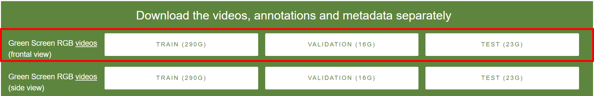
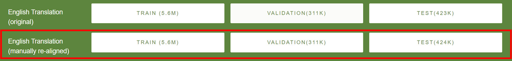

# myvoice

## Data Preparation

### Video Extraction - Dataset specific instructions
Each dataset publishes videos in different formats. This section describes the process for extracting individual videos from the datasets used in the this project.  

#### **How2Sign Dataset**

How2Sign datasets are published at https://how2sign.github.io/ Since these files are very large, please download the files using a browser of your choice. **Note**: while `wget` might work for smaller files like `val` and `test`, it fails while downloading 290GB Raw Files data due to Google Drive restrictions. Hence browser download is highly recommended. 

This document assumes that videos files are downloaded and extracted to `data/raw/<train|val|test>` folders. This document also assumes that all `csv` files are kept in `data/raw` folder.  

1. Download the following data files and extract the images to the corresponding folders:
  

2. Download the following csv files and place them in `raw` folder.  


3. For extracting all videos, you can use bash script as below. This script assumes default locations mentioned above. Change as necessary.
```sh
cd myvoice
bash scripts/how2sign_extract.sh
``` 

   For extracting subset data, please run the below command and adjust parameters as needed
```sh
cd myvoice
python3 src/aslsignjoey/data_extract.py --help
```


## Imported Libraries
We reference and use the following libraries. In order for these libraries to be included into the process pipelines or current versions, we had to make the following modifications.

### video_features - to extract features
https://github.com/v-iashin/video_features provides capabilities to extract features from videos using different models.  

The source code hardcodes the path to model checkpoints and hence doesn't work to include feature extraction in a pipeline like on a Edge device, or parallel processing with video formmating.

In this code, the following scripts are modified to use relative paths to identify checkpoint files

Files modified:
models/i3d/extract_i3d.py  
models/pwc/extract_pwc.py
models/raft/extract_raft.py
utils/utils.py 


**Note:** Only `extract_i3d.py` is used in `aslsignjoey`. Other files are changed to ensure conformance with `extract_i3d.py`.  


