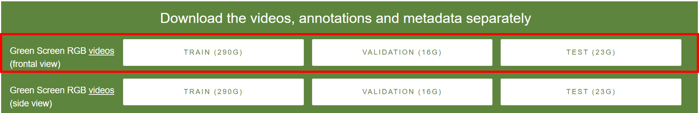
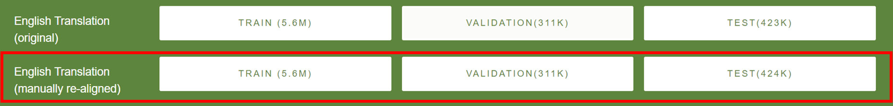

# How2Sign dataset preparation for training
Each dataset publishes videos in different formats. This section describes the process for getting [How2Sign dataset](https://how2sign.github.io) ready for training with the Joint End-to-End Sign Language Recognition and Translaton.  

How2Sign datasets are published at https://how2sign.github.io/ Since these files are very large, please download the files using a browser of your choice. **Note**: while `wget` might work for smaller files like `val` and `test`, it fails while downloading 290GB Raw Files data due to Google Drive restrictions. Hence browser download is highly recommended. 

This document assumes that videos files are downloaded and extracted to `data/h2s/raw` folders. This document also assumes that all `csv` files are kept in `data/raw` folder.  

**Note**: This repo renames the `val` in how2sign dataset to `dev` to match `slt` naming convention

```s
#Assumed input folder structure. Change parameters or scripts as needed. 
data
|-- h2s
   |-- raw  
       |-- test
       |-- train
       |-- dev
       |how2sign_realigned_test.csv
       |how2sign_realigned_train.csv
       |how2sign_realigned_dev.csv
```
## 1. Download data 

1. Download the following data files from How2Sign and extract the images to the corresponding folders:
  

2. This repo includes [How2Sign English Translation (manually re-aligned) with generated glosses (3MB)](data/h2s/how2sign_realigned_gls.zip). 

This curated dataset contains the glosses generated for each sentence using Achraf Othman's excellent tutorial [Tutorial 3](https://achrafothman.net/site/deployment-of-a-statistical-machine-translation-english-american-sign-language/). 

Extract this zip into `raw` folder.  

```s
cd myvoice
unzip data/h2s/how2sign_realigned_gls.zip -d data/h2s/raw
```

Alternatively, you may download the files from How2Sign site and place them in the `raw` folder. With this approach, you would need to generate glosses from other models. 
 
.


The rest of the steps assume that you are using the `how2sign_realigned_gls.zip` file that includes glosses.

## 2. Extract sentence clips
How2Sign raw videos contain full length videos containing multiple sentences. The below scripts extract individual sentences based on the clip start and end definition in `how2sign_realigned_gls.zip` files. 

For extracting all videos, use the bash script below. This script assumes default locations mentioned above. Change as necessary.  
**Note**: MoviePy is used for extracting video clips. It produces debug statements that cannot be turned off. The command below excludes the debug statements from `moviepy`  

```s
cd myvoice
bash scripts/data_extract.sh ./data/h2s/raw ./data/h2s/interim/ext how2sign_realigned_gls_ | grep -viE 'join|oviepy'
``` 

The above commands will extract information into the following structure
```s
#Output structure. Change parameters or scripts as needed. 
data
|-- h2s
   |-- raw # Retained from input
       |-- ...
   |-- interim
       |--ext  
         |-- test
         |-- train
         |-- dev
         |how2sign_realigned_gls_test.csv
         |how2sign_realigned_gls_train.csv
         |how2sign_realigned_gls_dev.csv
```

For using extraction script with other datasets, please learn about the available parameters using the command below, and adjust as needed

```s
cd myvoice
python3 src/aslsignjoey/data_extract.py --help
```

## 3. Format videos
How2Sign datasets are recorded at 1280 x 720 resolution. This resolution is very high for Machine Learning. Most models require a 224 x 224 pixel input video. Secondly, the information in the video is primarily in the center of the video. To enable input videos for feature extraction use the following script:  

```s
cd myvoice
bash scripts/data_format.sh ./data/h2s/interim/ext ./data/h2s/interim/fmt how2sign_realigned_gls_
``` 

The above commands will extract information into the following structure
```s
#Output structure. Change parameters or scripts as needed. 
data
|-- h2s
   |-- raw # Retained from input
       |-- ...
   |-- interim
       |--ext  # Retained from extract
         |-- ... 
       |--fmt  
         |-- test
         |-- train
         |-- dev
         |how2sign_realigned_gls_test.csv
         |how2sign_realigned_gls_train.csv
         |how2sign_realigned_gls_dev.csv
```

## 4. Extract Features
Extract features from formatted videos using the script below:  

```s
cd myvoice
bash scripts/data_features.sh ./data/h2s/interim/fmt ./data/h2s/interim/ft how2sign_realigned_gls_
``` 

The above commands will create features and store them in the following structure
```s
#Output structure. Change parameters or scripts as needed. 
data
|-- h2s
   |-- raw # Retained from input
       |-- ...
   |-- interim
       |--ext  # Retained from extract
         |-- ... 
       |--fmt  # Retained from Format
         |-- ...
       |--ft
         |-- test  # Contains .npy files
         |-- train # Contains .npy files
         |-- dev   # Contains .npy files
         |how2sign_realigned_gls_test.csv
         |how2sign_realigned_gls_train.csv
         |how2sign_realigned_gls_dev.csv
      
```

## 5. Prepare Data
Create pickle files containing for training the `slt` model
```s
cd myvoice
bash scripts/data_prep.sh ./data/h2s/interim/ft ./data/h2s how2sign_realigned_gls_ h2s_realigned_gls_i3d_all
``` 

The above command will create the following files
```s
#Output structure. Change parameters or scripts as needed. 
data
|-- h2s
    |how2sign_realigned_gls_test.pkl
    |how2sign_realigned_gls_train.pkl
    |how2sign_realigned_gls_dev.pkl
      
```

